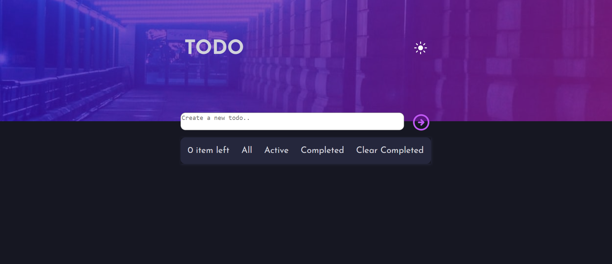

# Frontend Mentor - Todo app solution

This is a solution to the [Todo app challenge on Frontend Mentor](https://www.frontendmentor.io/challenges/todo-app-Su1_KokOW). Frontend Mentor challenges help you improve your coding skills by building realistic projects. 

## Table of contents

- [Overview](#overview)
  - [The challenge](#the-challenge)
  - [Screenshot](#screenshot)
  - [Links](#links)
- [My process](#my-process)
  - [Built with](#built-with)
  - [What I learned](#what-i-learned)
  - [Continued development](#continued-development)
  - [Useful resources](#useful-resources)
- [Author](#author)


## Overview

### The challenge

Users should be able to:

- View the optimal layout for the app depending on their device's screen size
- See hover states for all interactive elements on the page
- Add new todos to the list
- Mark todos as complete
- Delete todos from the list
- Filter by all/active/complete todos
- Clear all completed todos
- Toggle light and dark mode
- **Bonus**: Drag and drop to reorder items on the list

### Screenshot



### Links

- Solution URL: [Add solution URL here](https://your-solution-url.com)
- Live Site URL: [Add live site URL here](https://your-live-site-url.com)

## My process

### Built with

- Semantic HTML5 markup
- CSS custom properties
- Flexbox
- CSS Grid
- Mobile-first workflow
- [React](https://react.dev/)
- [Unicons](https://iconscout.com/unicons)
- [Google fonts](https://fonts.google.com/)

**Note: These are just examples. Delete this note and replace the list above with your own choices**

### What I learned

React Hooks
    useState()
    useEffect()

Responsiveness using React

```js
 useEffect(() => {
        window
        .matchMedia("(min-width: 375px)")
        .addEventListener('change', e => setMatches( e.matches ));
      }, []);

       {/* Destop View */}
      {props.matches && (
        <div className="desktopdesign" >
         <div><p>{props.number} {props.itemLeft}</p></div>
         <div onClick={props.all}><p>All</p></div>
         <div onClick={props.deleteSelected}><p>Active</p></div>
         <div onClick={props.completed} ><p> Completed</p></div>
         <div onClick={()=>{props.delAll(props.id)}}><p> Clear Completed</p></div>
       </div> )}

        {/* Mobile View */}
      {!props.matches && (<div className="mobileDesign">
        <div className="mobile1" >
          <div><p>{props.number} {props.itemLeft}</p></div>
          <div onClick={()=>{props.delAll(props.id); }}><p> Clear Completed</p></div>
        </div> 

        <div className="mobile2">
          <div onClick={props.all}><p>All</p></div>
          <div onClick={props.deleteSelected}><p>Active</p></div>
          <div onClick={props.completed}><p> Completed</p></div>
        </div>
      </div>
                
      )}
```


### Continued development

React hooks
Next.js


### Useful resources

- [Stackoverflow](https://www.stackoverflow.com) 

## Author

- Website - [Hashnode](https://abdulmajid.hashnode.dev/)
- Frontend Mentor - [@Snippet](https://www.frontendmentor.io/profile/abdulmajid48)
- Twitter - [@aladejanaamajid](https://www.twitter.com/aladejanaamajid)